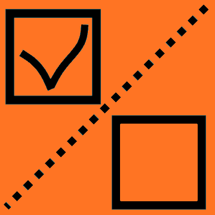

# Show And Hide Layers    

A simple QGIS plugin that allows you to turn visible vector, raster and point cloud layers on and off
 This is a useful option when vectorizing based on orthophotos, etc.

## **Tool buttons:**
* Hide / Show visible vector layers         
    
 Default shortcut Alt + 1

* Hide / Show visible raster layers    
    
 Default shortcut Alt + 2

* Hide / Show visible point cloud layers    
    
 Default shortcut Alt + 3
You can change shortcuts in Settings > Keyboard Shortcuts menu.

 
